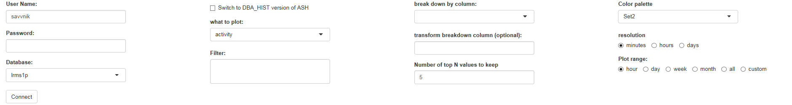

# ASH viewer

### Introduction
 
ASH viewer is a utility for interactively visualizing contents of Active Session History for Oracle databases. It's written on R shiny and allows one to connect to a database and view database activity broken down by wait event class (or by some other criteria). It has some similarity to Oracle Enterprise Manager (OEM) performance page plots commonly used for Oracle database performance monitoring and troubleshooting, but is more flexible.

### R shiny

ASH viewer is an R shiny app. R is a framework for processing, analyzing and visualizing data. R is free and it can run on most platforms as a desktop client, either on its own or via an integrated development environment like RStudio. You can also use it as a server app available as a web UI for multiple users, if you have an R server running. Or you could deploy it on an R server cloud like shinyapps.io, although I haven't tried it myself (depending on where your database is, connecting to it from the cloud can be tricky). 

### Prerequisites 

Following packages are necessary to run the ASH viewer:

- ROracle
- shiny
- RColorBrewer
- plotly
- lubridate
- dplyr
- ggplot2
- tidyr
- reshape2

Installing most of them is very straighforward (install.packages(<list of packages>)). Depending on your platform, you may need spend some time with ROracle as it needs to be integrated with the Oracle client for the app to work.

Be sure you can connect to the target database in an R session before trying to run the app.

### Basic controls
 
You can run the app same as any R shiny app, by opening server.R or ui.R in RStudio and pressing the "Run app" button. When you do that, should see something like:
 
  
 
Enter your username, database password, and the database connect string (e.g. host:port/service). If you are connecting to an Oracle Autonomous Database on the cloud, you need your wallet to be properly configured, this  [link](https://www.linkedin.com/pulse/connecting-rsudio-oracle-autonomous-database-via-anton-semchishen/) may help you with this.
 
 
 
 
Once you are logged in, you should be able to see a text message with the database name appear below the "Connect" button (in case of any issues, it should display the database error message explaining the reason of logon failure). Also, "Plot" button should appear next to "Connect" button. At this point, you can chose any of the dimensions available in ASH to visualize its contents. For example, if you chose MODULE in the "break down by column:" dropdown, and press "Plot", you will see a visual representation of the database activity (in average active sessions) broken down by module.
 
### Switch to DBA_HIST version of ASH
 
This checkbox toggles between GV$ACTIVE_SESSION_HISTORY view (containing only relatively recent events) and DBA_HIST_ACTIVE_SESS_HISTORY (with a typically much larger retention period). Checking this box may slow things down noticeably.
 
### What to plot
 
In contrast with traditional OEM performance graphs, ASH viewer utility allows one to visualize not only average active sessions, but also read/write I/O (in terms of requests per second or megabytes per second), as well as TEMP and PGA allocations or even interconnect traffic.
 
### Filter
 
Any valid SQL expression can be used there (without WHERE keyword), including an uncorrelated scalar subquery, e.g.
module!='rsession.exe' and user_id = (select user_id from dba_users where username = USER)
 
This field is also commonly used for restricting the analysis to a single instance (INST_ID=value or INSTANCE_NUMBER=value, both variants should work) if your database is a RAC cluster.
 
### Break down by column
 
As explained above, this is the dimension variable for your analysis. To put it simply, this is what will be shown as different colors on the stacked area chart. For example, if you chose "module", then each stripe will correspond to a different module, with the limitation that when there are too many distinct values, only top N values are shown and everything else is merged into a single band marked as "other" (to prevent the legends from taking too much space and too many color bands making the graph difficult to read). The number of top values is controlled by the "number of top N values to keep" field below.
 
### Transform breakdown column (optional)
 
In many cases you would want to use the dimension (breakdown) column as is. Sometimes, however, you may wan to use an expression or a scalar subquery on it. For example, you may want to use NVL to give a meaningful description for NULL values, e.g. 

```NVL(WAIT_CLASS, 'On CPU')```. 

Another scenario is when the dimension has a large number of similar values you'd like to merge into one, like when you have hundreds of modules named like mymodule_N, where N is some number, and you want to known their total contribution to the database activity, which you can achieve with `regexp_replace(module, '\\d', '')`. Note that you need to specify two escape characters instead of one in such cases. Finally, you may want to use a correlated subquery to decode values that are otherwise difficult to interpret, like `USER_ID`. The output will be much more user-friendly if USER_ID is replaced with 

```(SELECT USERNAME FROM DBA_USERS WHERE USER_ID=ash.user_id)```.

Note that the alias for linking with the main query is "ash" (no quotes).
 
### Number of top N values to keep
 
As already mentioned above, this is useful in cases when only top few values really matter, and you want to merge everything else into "other" to make the graph more readable. Default value of 5 is sufficient in most cases, but sometimes you may want to increase it to 10 or even 20. Values above 20 are not recommended as the legend portion of the graph starts to occupy most of its space.
 
### Color palette
 
In some cases default colors can be difficult to read. Just experiment with a few palettes until you find something that makes the output easier to read (or simply more appealing aesthetically).
 
### Resolution
 
When looking at broad intervals, default resolution of 1 minute may be too detailed, making it the graph both harder to read and slower to build, and 1 hour (or in rare cases, 1 day) may be more appropriate.
 
### Plot range
 
Self-explanatory. If you specify a broad time range, but only a small part of it is displayed, be sure to check the "Switch to DBA_HIST" checkbox. When standard choices are not enough, use "custom", and additional controls will appear, that will allow you to select start and end date and hour.
 
### Output
 
Sample output is shown below:
 
 
 
 